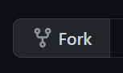

# Learn to Code (C#)

This is a general introduction to coding. It consists of a set of lessons that
will teach you the basics of coding. No previous knowledge is required! All you
need is a browser.

# Instructions

Start by forking the repo (Fork button at the top right) and then start going
through the lesson links below.

# Lessons

- [Lesson 1](lessons/1/Lesson1.md#lesson-1) - Hello World!
