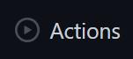
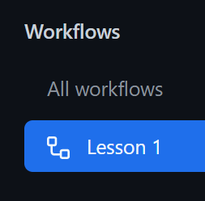
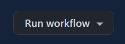
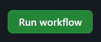
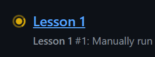
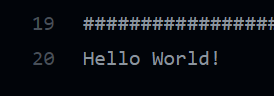

# Lesson 1

This lesson shows you how to build your very first C# program!

## What is a program?

A program is a set of instructions you give to the computer to make it do what
you want. A program usually starts out as a text file written by a person. That
file is then converted by a compiler or interpreter to a language the computer
can understand.

## Hello World!

You can find the code for the very first program [here](Program.cs), but it is
also copied below:

```C#
using System;

namespace lesson1
{
    class Program
    {
        static void Main(string[] args)
        {
            Console.WriteLine("Hello World!");
        }
    }
}
```

You can ignore most everything for now, but let's take a look at:

```C#
Console.WriteLine("Hello World!");
```

Let's break this down. It's telling the computer to have the `Console` (which is
just the window you using on the computer) "write a line of text" (`WriteLine`).
The text you want it to write to the windo is "Hello World!". When you run the
program you will see the following:

```
Hello World!
```

## Running the Program

To make things easy, we will leverage the build-in ability to run code in the
cloud provided by GitHub Actions.

### Enable GitHub Actions

When you first forked the repo, GitHub Actions were disabled by default. To
enable them, click the **Actions** tab (near the top middle):



And then click the button to accept and enable actions:


Now actions should be enabled!

### Manually Run the Action

Now let's run the action for this lesson. On the left, under the **Workflows**
list, find **Lesson 1** and click on it:



Next, on the right side, find and click on the **Run workflow** button:



And finally click the next **Run workflow** button to finally run it:



You might have to refresh the page (hit F5), but you should see a new run started
that looks like this:



Click on it, and then wait a few seconds for it to complete. Then find and click
on the **Build and Run** step to expand it:


At the bottom of that, you should see the final output of your program:



## How Did All That Work?

...

### Can I run all this locally?

You can follow the instructions [here](https://docs.microsoft.com/en-us/dotnet/core/install/windows?tabs=net60) to download and install the latest .NET on Windows. This would allow
you to run everything locally, instead of in the cloud; but for the sake of trying
to simply the setup, we will leverage the cloud instead.
